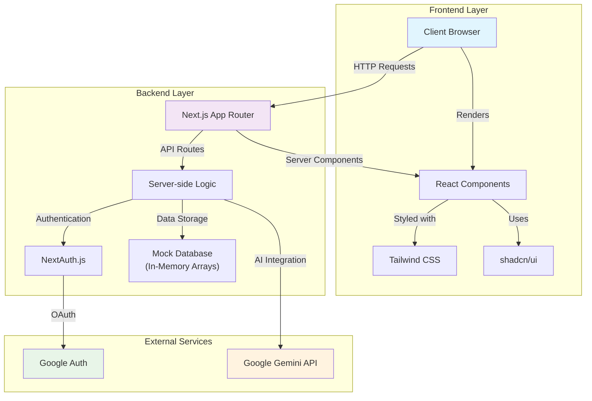

# 🚀 Mini CRM Platform

A modern, AI-powered CRM platform for intelligent customer segmentation and campaign management.


---

## 📋 Table of Contents

- [Local Setup Instructions](#-local-setup-instructions)
- [Architecture Diagram](#-architecture-diagram)
- [Component Architecture](#component-architecture)
- [AI Tools and Tech Stack](#-ai-tools-and-tech-stack)
- [Known Limitations & Assumptions](#-known-limitations--assumptions)
- [Future Production Requirements](#future-requirements-for-production)

---

## 🛠 Local Setup Instructions

### Prerequisites

- Node.js 18+ and npm/yarn
- Google OAuth credentials
- Google Generative AI API key

### 1. Clone the repository

```bash
git clone https://github.com/yourusername/mini-crm-platform.git
cd mini-crm-platform
```

### 2. Install dependencies

```bash
npm install
# or
yarn install
```

### 3. Configure environment variables

Create a `.env.local` file in the root directory:

```env
GOOGLE_CLIENT_ID=your_google_client_id
GOOGLE_CLIENT_SECRET=your_google_client_secret
GOOGLE_GENERATIVE_AI_API_KEY=your_gemini_api_key
NEXTAUTH_URL=http://localhost:3000
NEXTAUTH_SECRET=your_nextauth_secret
```

#### How to get credentials

- **Google OAuth:**  
  1. Go to [Google Cloud Console](https://console.cloud.google.com/)
  2. Create/select a project
  3. Navigate to "APIs & Services" > "Credentials"
  4. Click "Create Credentials" > "OAuth client ID"
  5. Set up the OAuth consent screen if prompted
  6. Select "Web application"
  7. Add `http://localhost:3000/api/auth/callback/google` as an authorized redirect URI
  8. Copy the Client ID and Secret to your `.env.local`

- **Google Generative AI API Key:**  
  1. Go to [Google AI Studio](https://makersuite.google.com/app/apikey)
  2. Create a new API key and copy it to your `.env.local`

- **NextAuth Secret:**  
  Generate with:
  ```bash
  node -e "console.log(require('crypto').randomBytes(32).toString('base64'))"
  ```

### 4. Run the development server

```bash
npm run dev
# or
yarn dev
```

Open [http://localhost:3000](http://localhost:3000) in your browser.

---

## 🏗 Architecture Diagram



---

### Component Architecture

```
app/
├── api/                          # API Routes
│   ├── auth/[...nextauth]/       # NextAuth configuration
│   ├── customers/                # Customer CRUD operations
│   ├── campaigns/                # Campaign management
│   ├── orders/                   # Order management
│   ├── vendor/                   # Mock vendor endpoints
│   └── ai/                       # AI integration endpoints
│       ├── generate-rules/       # Natural language to rules
│       ├── message-suggestions/  # AI message generation
│       └── campaign-insights/    # AI analytics
├── customers/                    # Customer management pages
├── campaigns/                    # Campaign management pages
│   └── create/                   # Campaign creation wizard
├── analytics/                    # Analytics dashboard
└── globals.css                   # Global styles

components/
├── ui/                           # shadcn/ui components
├── auth/                         # Authentication components
├── customers/                    # Customer-specific components
└── campaigns/                    # Campaign-specific components
    ├── rule-builder.tsx          # Visual rule builder
    ├── natural-language-segments.tsx  # AI-powered segmentation
    ├── ai-message-suggestions.tsx     # AI message generator
    └── audience-preview.tsx       # Audience size preview
```

---

## 💻 AI Tools and Tech Stack

### AI Integration

- **Google Gemini (Primary AI Engine)**
  - Model: `gemini-1.5-flash`
  - Provider: `@ai-sdk/google`
  - Use Cases: segmentation, message generation, analytics

- **AI SDK by Vercel**
  - Package: `ai`
  - Functions: `generateText()` for text generation

### Frontend

- Next.js 15 (App Router)
- React 18 (Server Components)
- TypeScript
- Tailwind CSS
- shadcn/ui
- Lucide React (icons)

### Backend

- Next.js API Routes
- NextAuth.js (Google OAuth)

### Development Tools

- ESLint, Prettier, PostCSS

---

### AI Implementation Examples

#### Natural Language Segmentation

```typescript
const { text } = await generateText({
  model: google("gemini-1.5-flash"),
  system: "Convert natural language descriptions into structured rules...",
  prompt: `Convert this customer segment description to rules: "${prompt}"`
});
```

#### AI Message Generation

```typescript
const { text } = await generateText({
  model: google("gemini-1.5-flash"),
  system: "Generate marketing messages for campaigns...",
  prompt: `Generate 3 message suggestions for a ${campaignType} campaign.`
});
```

#### Campaign Insights

```typescript
const { text } = await generateText({
  model: google("gemini-1.5-flash"),
  system: "Analyze campaign data to provide actionable insights...",
  prompt: "Analyze this marketing data and provide insights..."
});
```

---

## ⚠️ Known Limitations & Assumptions

### Data Storage
- **Mock Database**: In-memory arrays, no persistence
- **Data Loss**: All data resets on server restart
- **No Scalability**: Not suitable for multiple server instances
- **Production Requirement**: Needs real database (PostgreSQL, MongoDB, etc.)

### AI Integration
- **API Key Dependency**: Requires valid Google Gemini API key
- **Rate Limiting**: Subject to Google's API limits (60 req/min on free tier)
- **Language Support**: Optimized for English
- **Context Window**: Limited by Gemini's token limits
- **Error Handling**: Basic error handling for AI failures

### Authentication
- **Single Provider**: Only Google OAuth supported
- **No Role Management**: All users have identical permissions
- **Session Management**: Uses NextAuth.js defaults
- **No Multi-tenant**: Single organization only

### Campaign Delivery
- **Simulated Delivery**: No real SMS/Email provider integration
- **Mock Receipts**: Delivery status randomly generated (90% success)
- **No Real Personalization**: Template-based only

### Scalability
- **Single Instance**: Not designed for horizontal scaling
- **Memory Limitations**: In-memory storage limits concurrent users
- **No Caching**: No Redis or distributed caching
- **No Queue System**: No background job processing

### Browser & Platform
- **Modern Browsers**: Requires ES6+ and JavaScript enabled
- **Desktop Optimized**: UI designed for desktop
- **Internet Dependency**: AI features require internet

### Security
- **Environment Variables**: Sensitive keys in env files
- **No Input Validation**: Limited server-side validation
- **CORS**: Default Next.js settings
- **No Rate Limiting**: No API rate limiting

### Development Assumptions
- **Development Mode**: Not production-optimized
- **Localhost Only**: Designed for `localhost:3000`
- **No Monitoring**: No performance monitoring
- **Basic Logging**: Console logs only

---

## Future Requirements for Production

1. **Database Integration**: PostgreSQL, MongoDB, etc.
2. **Real Messaging Providers**: Twilio, SendGrid, etc.
3. **Caching Layer**: Redis for performance
4. **Queue System**: Bull, Agenda, etc. for background jobs
5. **Monitoring**: Application and error monitoring
6. **Security**: Input validation, rate limiting, CSRF protection
7. **Testing**: Unit, integration, and E2E tests
8. **CI/CD**: Automated deployment pipeline

---

<div align="center">

**Built with ❤️ using Next.js, TypeScript, and Google Gemini AI**

</div>